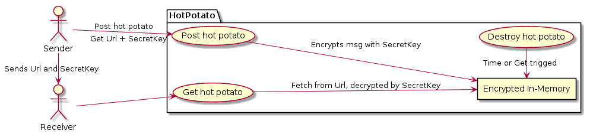

# Hot Potato

Sending a `Hot Potato` to someone.

**Words of warnings:** This does not scale. There are Concurrency, Thread issues and risk of Raise Conditions. No data is persisted, only kept in memory so if the process restarts, the posted data is gone.

Why all these known drawbacks?  
Too learn, one sometimes have to create problems to solve.

## Demo site

[https://hotpotato.mccc.se](https://hotpotato.mccc.se)

## The Problem

We have often seen sensitive information like passwords being sent over channels
where the sender/receiver don't have full control over the integrity of the data.
Sometime the helpdesk *generates* a *random* password like: *summer2020* and a
message saying: *-Change at you first login*. Which of course never happens.
So it happens that passwords are the same for many people and stores in chats.

So I wanted to learn a bit more `Ruby`and play around with ways of handling the *Problem*.
Some of the problem areas identified are:

- Is it encrypted in transit?
- Is it encrypted at rest?
- How long is it stored?
- Can we be sure only the intended receiver reads it?

## The solution

Simplified logical overview says there are two involved parties,
`Sender` and `Receiver`, and the do only two simple things `Post` or `Get`.
The Sender `Post` a `hot_potato` (aka some secret info) and a `secret_password` to encrypt/decrypt it.
The `System` returns a `unique_id` where the hot_potato can be retrieved.
Senders gives the ID and secret_password to the Receiver which unlocks and deletes the hot_potato.



The implementation is written as a `Sinatra` webapp with class `PotatoCollection` including `Singleton` to initialize a in-memory hash where the `unique_id` is the hash key and the values is another hash:

```ruby
{msg: encrypted, salt: salt, iv: iv, ttl: end_of_life}
```

The PotatoCollection initialize also starts a asynchronous `SuckerPunch::Job` background job which every 60 seconds calls the `PotatoCollection.check_ttl` method to delete all hot_potatoes where ttl has run out.


## Demo deployment

On the `hotpotato.mccc.se` deployment `kamal-proxy` handles `TLS` and `ProxyPass` traffic to `puma` running the `Sinatra` app.

## Ruby version

Written using 3.3.5

## CI/CD

Running `GitHub Actions` as defined in `.github/workflows/ruby.yaml`.
Should add the `rspec` tests, but have not made it run in GitHub.
It is scanned by `standardrb app.rb` and `erblint views/*`.
